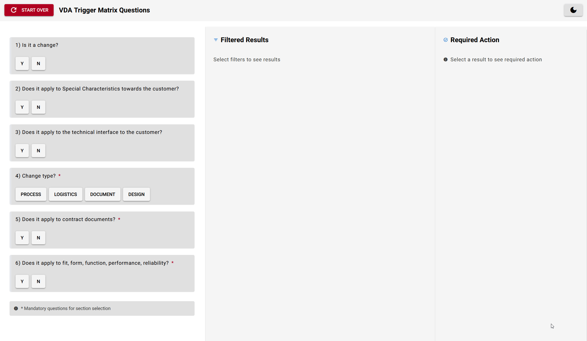

# Form Matrix Web App Demo



I built this project after seeing how a couple of friends uses Excel-based forms for their work. Coming from a mechanical engineering background, I've seen firsthand how many companies rely on Excel for processes that could be made much simpler with a proper web form. But here's the catch - many can't use external form tools due to compliance requirements.

## Why This Exists
The main goal was to create a lightweight form application that:

- Runs completely in-house without external services
- Handles matrix-based decision flows (common in manufacturing/engineering processes)
- Works offline
- Complies with internal data handling requirements
- Can be easily distributed to users

## Technical Implementation
I kept the implementation straightforward and practical:

- Built with Python and NiceGUI for the interface
- Used a custom DataMatrix class instead of Pandas to keep it lightweight (especially important if you need to compile it with PyInstaller)
- Implemented dark/light theme support because eye strain is real when you stare at forms all day

## Project Structure
```
├── config/
│   └── settings.py         # UI configuration and theme settings
├── core/
│   ├── connection_manager.py
│   └── data_matrix.py      # Data handling implementation
├── data/
│   └── default_data.py     # Sample data structure
├── ui/
│   ├── components/         # UI components
│   └── app.py             # Main application logic
├── utils/
│   └── helpers.py         # Utility functions
└── main.py                # Application entry point
```

## Getting Started
1. Clone the repository
2. Install the dependency:
```bash
pip install nicegui
```

3. Run the application:
```bash
python main.py
```

## Customization
The code is modular so you can adapt it for your needs:
- Modify the data structure in `default_data.py`
- Adjust the UI components in `ui/components`
- Add your own validation logic
- Change the theme settings in `settings.py`

## Dependencies
I deliberately avoided using Pandas or other heavy libraries. In my experience, keeping dependencies minimal makes distribution and maintenance much easier, especially in corporate environments.

## Disclaimer
This is a demonstration project. While it's built based on real-world requirements, make sure it meets your specific compliance needs before using it in production.

## License
MIT License - Free to use and modify.

---
Built by a mechanical engineer who learned that not everything needs to be done in Excel.
